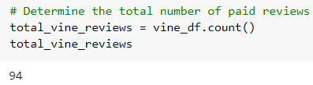
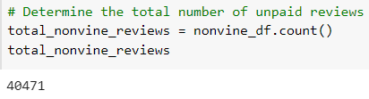
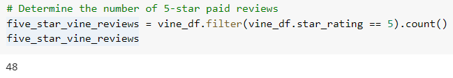
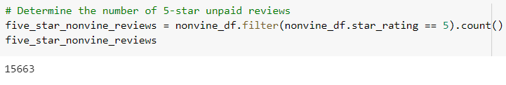
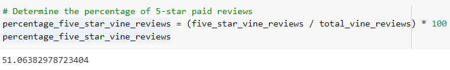
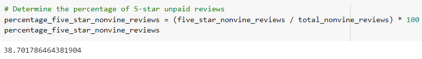

# Amazon_Vine_Analysis

## Overview of the analysis
The purpose of this analysis is to determine if there is any bias towards reviews that were written as part of the Vine program.

## Results

- How many Vine reviews were there?

- How many non-Vine reviews were there?

- How many Vine reviews were 5 stars? 

- How many non-Vine reviews were 5 stars?

- What percentage of Vine reviews were 5 stars?

- What percentage of non-Vine reviews were 5 stars?

## Summary

Based on the results, we can say that there is a positivity bias for reviews in the Vine program because 51% of the paid reviews were 5 stars and 38.7% of non-paid reviews were 5 stars.

An "Amazon Verified Purchase" review means that the person writing the review purchased the product at Amazon and did not receive the product at a deep discount. A more thorough analysis could be made by determining the total number of reviews, the number of 5-star reviews, and the percentage of 5-star reviews for the two types of review (paid vs unpaid) for verified_purchase equals Y and N.
