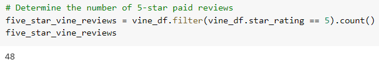

# Amazon_Vine_Analysis

## Overview of the analysis
The purpose of this analysis is to determine if there is any bias towards reviews that were written as part of the Vine program.

## Results
Using bulleted lists and images of DataFrames as support, address the following questions:

- How many Vine reviews were there?

- How many non-Vine reviews were there?

- How many Vine reviews were 5 stars? 

- How many non-Vine reviews were 5 stars?

- What percentage of Vine reviews were 5 stars?

- What percentage of non-Vine reviews were 5 stars?

## Summary

In your summary, state if there is any positivity bias for reviews in the Vine program. Use the results of your analysis to support your statement. 
Then, provide one additional analysis that you could do with the dataset to support your statement.

================
 For this analysis, you'll determine if having a paid Vine review makes a difference in the percentage of 5-star reviews.